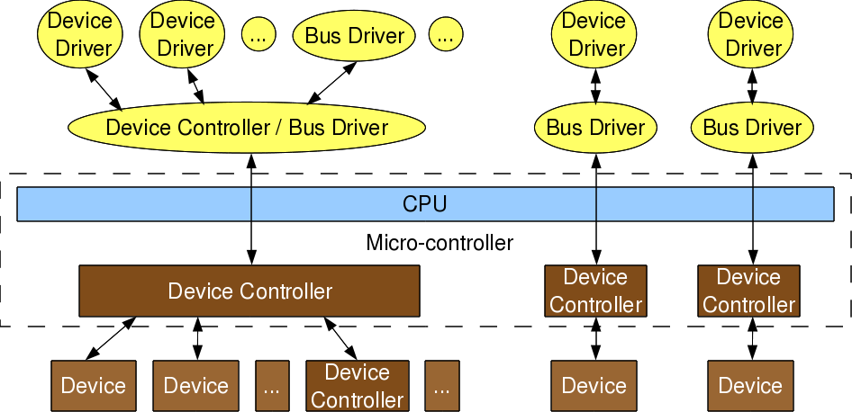
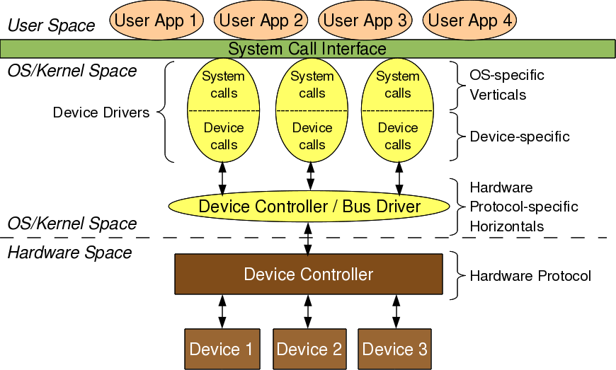
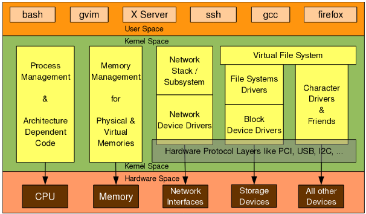

# Lesson 1- Linux Device Drivers for Your Girlfriend
## Drivers
- **Driver**: one who drives (in other words: manages, controls, directs, and monitors) the entity under its command.
	- **Device Driver**: one who manages, controls, directs, and monitors the *device* under its command
	- **Device Examples**: mouse, keyboard, camera, screen, or any peripheral connected to a computer
## Terminology
- Device ***driver*** = any software driving another device
- Device ***controller*** = a device driver controlling another device
	- Are actually devices themselves, too, which often times need their own drivers commonly known as *bus* drivers to communicate with architecture-specific protocols (talked about later)
	- **Controller Examples**: display controllers, audio controllers, or any controllers for hardware protocols (USB controller, SPI contr., I2C contr., etc.)
	  Image of hierarchy

## Buses
**Bus**: collection of physical lines connecting a respective device controller to the CPU (Ex: USB bus, SPI bus, etc.)
- Embedded within a single chip most of the time to conserve space & cost

## Drivers' Two Parts
 As seen here, the actual device drivers are represented as the yellow ovals, split in half between
1. OS-specific system calls
2. Device-specific calls

The *device-specific portion (#2)* remains the same across all OS's. **It is a way of communicating with the bus drivers, who provide hardware-specific interfacing for all hardware protocols.**

However, the *OS-specific portion (#1)* is tightly knit with the respective OS' mechanisms. This is what differentiates a Linux device driver froma Windows or Mac one.

## Verticals

A driver in Linux can be classified into 3 verticals:
1. **Packet**-oriented Network vertical)
2. **Block**-oriented Storage Vertical
3. **Byte**-oriented Character vertical

These 3 verticals (along with a CPU vertical and Memory vertical) make up the 5 core managements of an OS:
1. CPU/processes
2. Memory
3. Network
4. Storage
5. Device I/O

*Note:* unlike the other three verts, code in the CPU and memory verts are mainly a Linux porting effort, where users can't really add their own code since they're made specifically for a new CPU/architecture. Adding onto that, drivers in these verticals cannot be loaded/unloaded on the fly like the other three. Thus...
#### **This course won't focus on the CPU and Memory management verticals**

### Sub-Verticals
**Network Vert consists of**
1. Network protocol stack &
2. Netwrok interface card (NIC)
	-  Includes any network device drivers, such as Ethernet or Wi-Fi
	  
**Storage Vert consists of**
1. File system drivers (for decoding various file formats)
2. Block device drivers for storage protocols

**Char Vert consists of...**
***mostly any external hardware devices that handle data as a stream of individual bytes rather than fixed-size blocks**
- Include serial ports, audio/sound systems, keyboards, mice, printers -- the majority of commerical devices out there!

