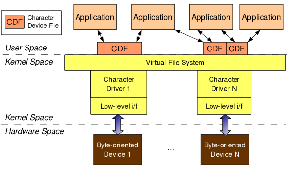
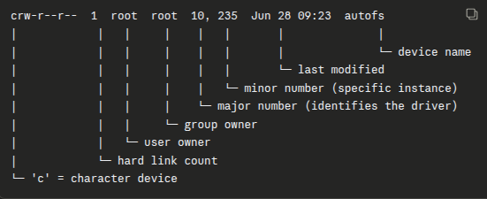
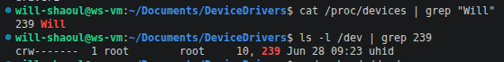
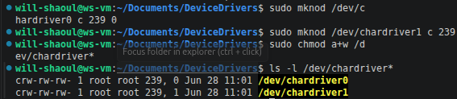

# Lesson 4: Linux Character Drivers
If we write drivers for byte-oriented operations (or, in C lingo, character-oriented operations), then we refer to them as **character drivers.** 
- Since the majority of devices are byte-oriented, the majority of device drivers are character device drivers.

Examples include serial, audio, video, camera, and basic I/O drivers
- In fact, *all drivers that aren't storage or network device drivers are some type of character driver*
***
## The Connection

For any user-space application to operate on a byte-oriented device, it must use the corresponding char device driver in kernel space.
Using these drivers is done through char device files that are linked through the VFS. Thus,
	1. An application does usual file operations on a character device file
	2. These operations are translated to the functions in the linked char device driver by the VFS
	3. These functions do the final low-level access to the actual device

### The four major entities involved in the connection
1. Application in user-space
2. Character Device File
3. Character Device Driver
4. Character Device

**These four entities are only connected if done so explicitly**:
- The *Application* connects to a *Device File* via invoking an `open` syscall on that device file.
- The *Device File* is linked to the *Device Driver* by specific registrations by the Driver
- *Device Driver* is linked to the *Device* by its device-specific low-level operations

It can be noted that the character device file is not the actual device but just a placeholder

  ## Major & Minor \#
Although the connection between the application and the device file is based on the device file's name (as stated before, calling `open` on the file's name), **the device file and device driver's connection is based on the *number* of the device file.** 

This device file number is actually a pair of numbers, major and minor `<major, minor>`. It is common for multiple drivers to be under the same major number with many different minor numbers
The `$ ls -l /dev/ | grep “^c”` command lists the many char device files on your system, and a snippet of some of mine are shown below:
```bash
$ ls -l /dev/ | grep “^c”
crw-------  1 root        root     89,   0 Jun 28 09:23 i2c-0
...
crw--w----  1 root        tty       4,   0 Jun 28 09:23 tty0
crw--w----  1 root        tty       4,   1 Jun 28 09:23 tty1
crw--w----  1 root        tty       4,  10 Jun 28 09:23 tty10
crw--w----  1 root        tty       4,  11 Jun 28 09:23 tty11
crw--w----  1 root        tty       4,  12 Jun 28 09:23 tty12
```
The way to read the above's output is shown here:

- The i2c driver has major # 89, minor 0.
- The serial ports have the major # 4 with many minor numbers 0, 1, 10, etc., and are aptly named `tty[minor#]`.

  ## `<linux/...>` Major & Minor # Support
Type defined in `<linux/types.h>`:
```C
dev_t // contains both major & minor numbers
```
Macros:
```C
MAJOR(dev_t dev) // extracts the major number from dev
MINOR(dev_t dev) // extracts the minor number from dev
MKDEV(int major, int minor) // creates the dev from major & minor
```
Connecting the devic file to the device drivers involves
### 1. Registering the `<major, minor>` range of device files
Achieved with either
```C
// a
int register_chrdev_region(dev_t first, unsigned int cnt, char *name);
// or
// b
int alloc_chrdev_region(
    dev_t *first, unsigned int firstminor, unsigned int cnt, char *name);

```
a. Registers `cnt` number of device file numbers starting from first
b. Dynamically finds free mjaor number and registers `cnt`
 number of device file numbers from the first free major
### 2. Linking the device file operations to the device driver functions
#### *Changes made to ofd.c in the Lesson4 directory*
The same steps are followed the load and check on the driver:
1. Build the driver (`.ko` file) with `make`
2. Load driver with `insmod`
3. List drivers with `lsmod`



As seen here, the char device named "Will" has major # 239. However, there are no device files present in the `/dev/` directory with major number 239 or the device name "Will" (the one shown has major # 10, *minor* 239). **You must create them with `mknod` (shown below).**


##### Writing (`echo " " >`) and reading (`cat`) from the driver will not work yet, however. As mentioned before, device file operations still need to be linked... (Lesson 5)